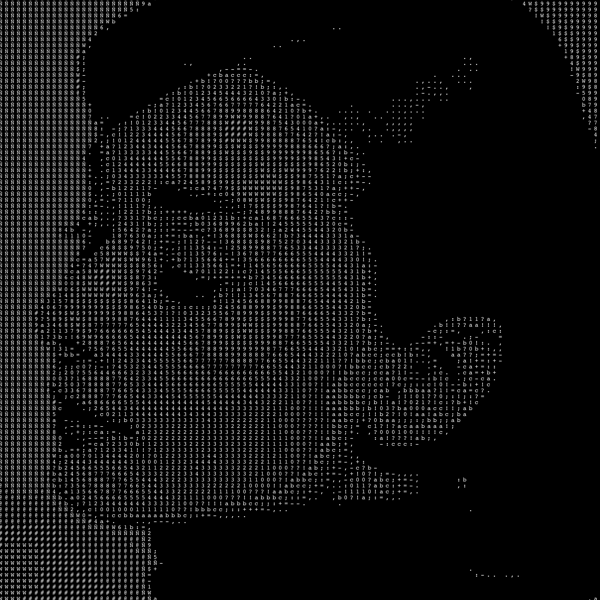
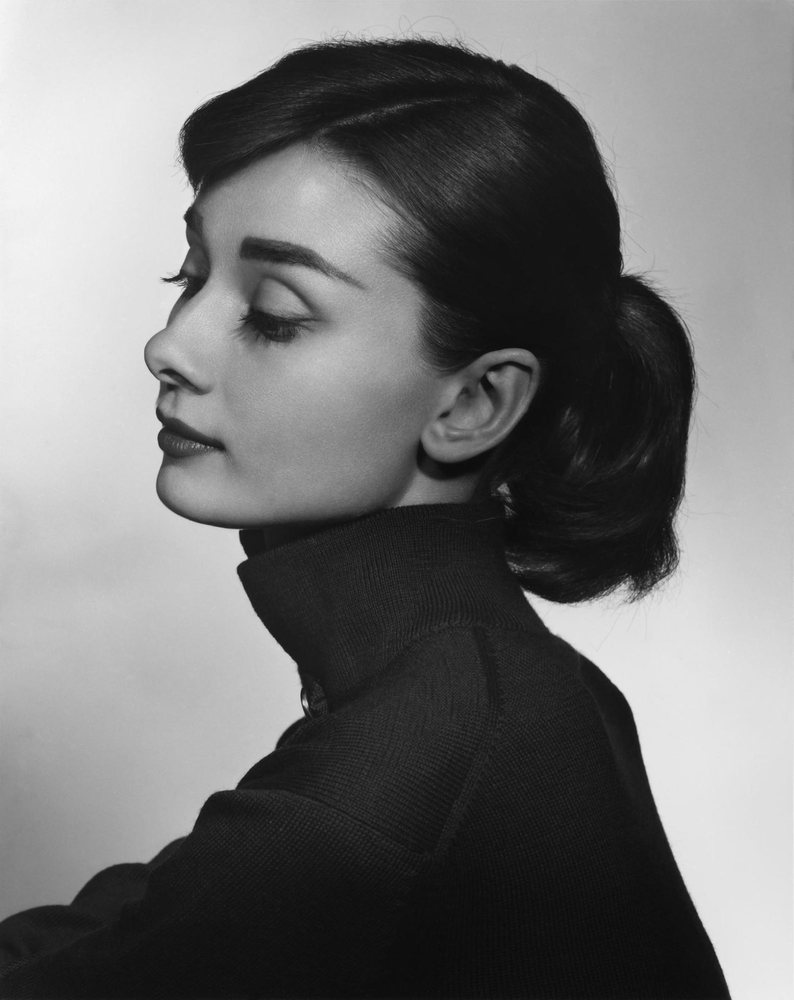
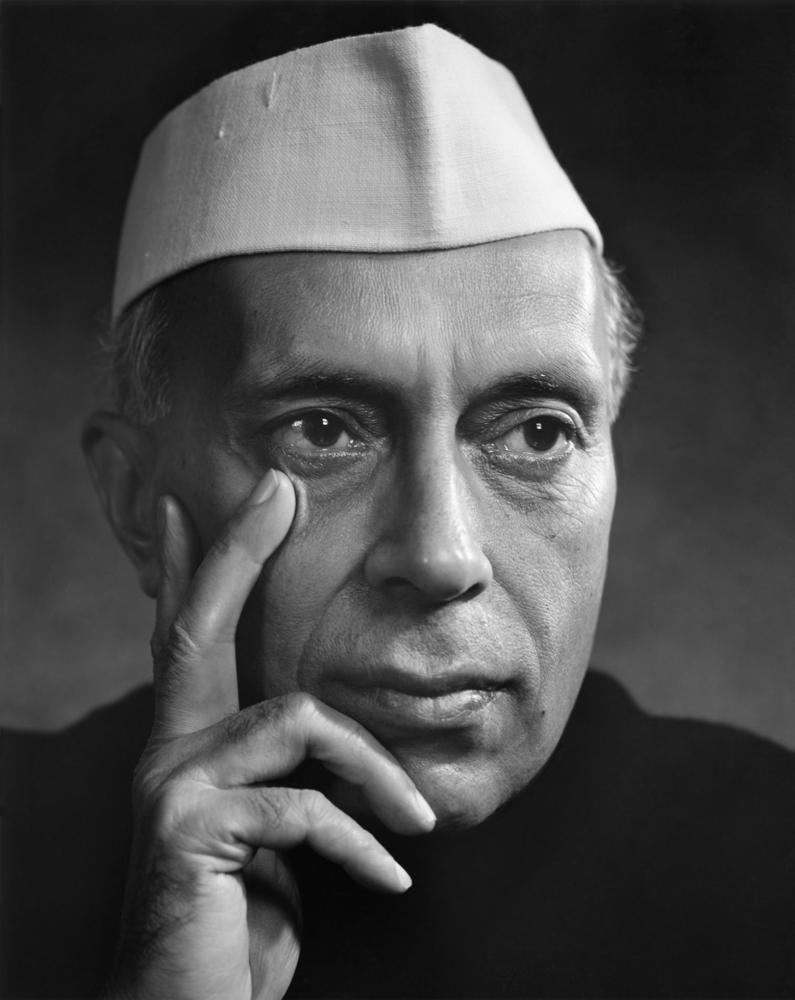
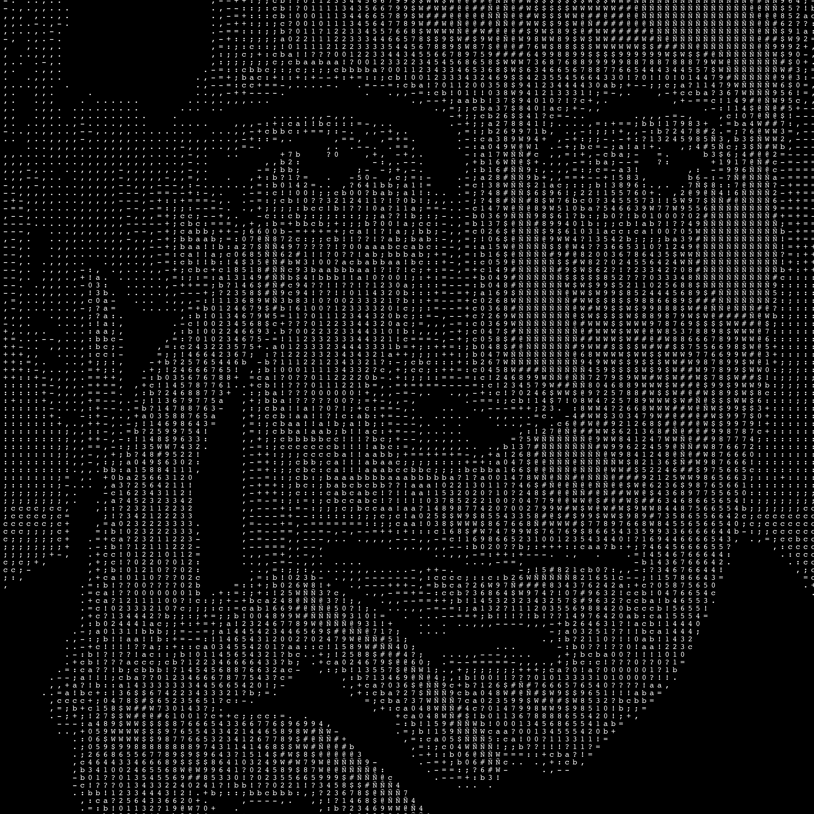

# image-to-ascii-svg
An image to ascii converter which outputs to SVG format for poster printing. Inspired by [CodingTrain's Coding Challenge #166](https://thecodingtrain.com/challenges/166-image-to-ascii) and [Karthik Iyer's similar implementation](https://github.com/KarthikRIyer/image2ascii) in Rust.

The script uses `pillow` to read images and increase their contrast, then extract the raw RGB data.
Then, luminance values are calculated for each pixel and linearly interpolated onto a "density string",
or a series of characters that appear decreasingly brighter.

The density string included in the project is: `"Ñ@#W$9876543210?!abc;:+=-,.   "` which is a lightly modified version
of CodingTrain's density string.



## Run it yourself

This project was written for and tested with Python 3.12.

You can run this project by installing the dependencies with a Python virtual environment:
```shell
python3.12 -m venv env
source env/bin/activate
pip install -r requirements.txt
```

Place input PNG and/or JPG files into the `input/` directory.

Then, run the script:
```shell
python image2ascii.py
```

Your converted images will be saved to the `output/` directory. Existing files with the same name in `output/` will be overwritten.

## More Examples
Photo of Audrey Hepburn by Yousuf Karsh, 1956. (Cropped so that the characters are more visible on web.)



Photo of Jawaharlal Nehru by Yousuf Karsh, 1956.  (Cropped so that the characters are more visible on web.)

